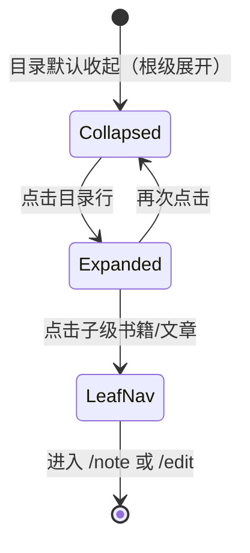

# 首页目录展示方案：树形结构列表（修订）

> 本文修订 `docs/product-home-books-articles.md` 中的首页列表形态。  
> **本版变更**：主页文档列表改为**树形结构**展示；**目录项可点击展开/收起**；列表项**区分书籍与文章**；**书籍的分页不在列表中展示**。

关联口径（不变）：

- 创建仅 **文章 / 书籍**；分页在编辑书籍时增删改查（`docs/product-doc-types.md`）。
- `docType`: `article | book | page`（缺省 article）。
- 书籍正文 = 分页目录；查看书籍/分页时左侧 TOC。

---

## 1. 首页定位

**一句话**：主页用**一棵可展开的目录树**列出当前服务下的文档；节点上标明是**书籍**还是**文章**；**目录**可展开子项；**书籍节点不展开其分页**（分页只在书籍编辑器/阅读 TOC 中出现）。

| 目标 | 做法 |
| --- | --- |
| 浏览结构 | 树形列表：目录展开/收起，缩进表示层级 |
| 区分类型 | 节点徽章/图标：**书籍** \| **文章** \| **目录** |
| 不淹没书内细节 | **`page` 不出现在树中**；书籍节点为「叶子书」 |
| 快速开写 | Hero「新建文档」→ 文章 \| 书籍 |
| 管理分页 | 选中书籍 →「编辑书籍」→ 分页 CRUD |
| 首页笔记 | 可选钉住 `_index`，不作为树节点混入 |

**非目标（首页）**：在树内新建/删除分页；拖拽移动分页；目录节点的独立 docType 实体。

---

## 2. 树模型

### 2.1 节点类型

| 节点 | 标识 | 可展开？ | 点击行为 | 出现在树中 |
| --- | --- | --- | --- | --- |
| **目录** | `dir` | **是**（有子节点时） | **展开/收起**（不跳转文档） | 虚拟节点，由 path 前缀汇聚 |
| **书籍** | `book` | **否**（不展示分页） | 进入 `/note/{path}` 或选中后操作 | `docType=book` |
| **文章** | `article` | 否 | 进入 `/note/{path}` | `docType=article` 或缺省 |
| **书籍分页** | `page` | — | — | **不展示** |

```text
📁 notes/                    ← 目录 dir，点击展开
   📄 会议草稿               ← 文章 article
   📖 Cloudflare 手册        ← 书籍 book（不展开其分页）
   📁 drafts/                ← 目录 dir，点击展开
      📄 周末徒步            ← 文章
📖 读书笔记                  ← 书籍（根级，无子展示）
📄 独立文章                  ← 文章（根级）
```

> 不出现：`Cloudflare 手册` 下的 `intro`、`install` 等 **分页**。

### 2.2 目录从哪里来（虚拟目录）

系统**没有**「目录」这种文档类型；目录由 **path 公共前缀** 在列表组装时生成：

1. 取应展示文档集合 `S`：
   - `docType ∈ {book, article}`，以及 `docType` 缺省（视为 article）
   - **排除** 全部 `docType=page`
   - 排除保留项 `_index` / 遗留 `.index`（走钉住卡）
2. 对每个 path 按 `/` 切段，例如 `notes/drafts/wip` → 前缀 `notes`、`notes/drafts`。
3. 若某前缀在 `S` 中有子项，则生成 **`dir` 节点**（path=`前缀`，title=末段）。
4. 若某 path **同时**是文档又是前缀：
   - 该 path 是 **书籍** → 树中只出现 **书籍节点**，**不**再为它生成 dir，也不列出其下 page（page 本就不在 S）。若有非 page 的异常子项（如误放在 `bookpath/xxx` 的文章），P0 可将其折叠进该书节点操作菜单「书内异常路径」，或仍作为该书的隐藏子级——**推荐 P0：非 page 子项挂在书节点下仅当 `bookRef ≠ 该书`；正常 page 一律不展示**。
   - 该 path 是 **文章** 且还有子 path 文档 → 树中该节点 **既是文章又是目录**：展示为「文章 + 可展开」双标识（少见）；点击行主体进文章，点击展开箭头展开子项。
5. 根级节点：无 `/` 的文档 + 顶层 dir + 顶层 book/article。

### 2.3 排序（同级）

| 优先级 | 规则 |
| --- | --- |
| 1 | 目录 `dir` 优先（便于浏览结构） |
| 2 | 书籍 `book` |
| 3 | 文章 `article` |
| 同类型 | `updateAt` 降序 → title/path 字典序 |

可选 P1：用户排序或 `updateAt` 全局优先（设置项）。

### 2.4 展开状态

| 规则 | P0 |
| --- | --- |
| 默认 | 根级全部展开；嵌套目录默认收起 |
| 记忆 | `localStorage` 按 path 记录展开集（键 `homeTreeExpand`） |
| 搜索命中 | 自动展开命中节点的所有祖先目录 |
| 刷新/回主页 | 读取 localStorage |

---

## 3. 信息架构

```text
/ 主页
├─ Hero
│    ├─ [新建文档] → 对话框：文章 | 书籍
│    └─ [编辑首页] → /edit/_index
├─ 首页笔记卡（可选 _index）
├─ 文档树工具条
│    ├─ 标题「文档」+ 计数（仅计入展示节点：文章+书籍，不含目录与分页）
│    ├─ 搜索框
│    ├─ 筛选：全部 | 文章 | 书籍 |（可选）目录内收起匹配
│    └─ 操作：全部展开 / 全部收起 · [新建文档]
├─ 树形列表（主区）
│    ├─ 目录行（可展开）
│    ├─ 书籍行（类型徽章，不展示分页）
│    └─ 文章行（类型徽章）
│    └─ 加载更多（仅当扁平数据未拉全时）
└─ Statusbar
```

```svg
<svg xmlns="http://www.w3.org/2000/svg" viewBox="0 0 680 860" font-family="-apple-system,'PingFang SC','Microsoft YaHei',sans-serif">
  <rect width="680" height="860" fill="#f3f3f3"/>
  <text x="40" y="32" font-size="14" font-weight="500" fill="#333">首页 · 树形目录列表</text>
  <rect x="40" y="52" width="600" height="760" rx="12" fill="#fff" stroke="#d4d4d4"/>
  <rect x="40" y="52" width="600" height="36" fill="#e7e7e7"/>
  <rect x="56" y="60" width="64" height="20" rx="4" fill="#fff" stroke="#d4d4d4"/>
  <text x="66" y="74" font-size="11" fill="#333">* 首页</text>

  <text x="68" y="120" font-size="20" font-weight="600" fill="#333">云端文档库</text>
  <rect x="68" y="136" width="100" height="34" rx="8" fill="#0e639c"/>
  <text x="88" y="158" font-size="12" fill="#fff">新建文档</text>
  <rect x="178" y="136" width="88" height="34" rx="8" fill="#fff" stroke="#d4d4d4"/>
  <text x="196" y="158" font-size="12" fill="#333">编辑首页</text>

  <rect x="68" y="190" width="544" height="56" rx="8" fill="#f8f8f8" stroke="#d4d4d4"/>
  <text x="84" y="214" font-size="12" font-weight="600" fill="#005fb8">首页笔记 _index</text>
  <text x="84" y="234" font-size="11" fill="#616161">仪表盘 · 不在树中</text>

  <text x="68" y="280" font-size="14" font-weight="600" fill="#333">文档</text>
  <text x="112" y="280" font-size="12" fill="#8b8b8b">文章 4 · 书籍 2</text>
  <rect x="300" y="264" width="220" height="28" rx="8" fill="#fff" stroke="#d4d4d4"/>
  <text x="312" y="282" font-size="11" fill="#8b8b8b">搜索…</text>
  <rect x="530" y="264" width="40" height="28" rx="6" fill="#fff" stroke="#d4d4d4"/>
  <text x="538" y="282" font-size="11" fill="#333">展开</text>

  <rect x="68" y="300" width="48" height="24" rx="12" fill="#005fb8"/>
  <text x="78" y="316" font-size="11" fill="#fff">全部</text>
  <rect x="124" y="300" width="48" height="24" rx="12" fill="#fff" stroke="#d4d4d4"/>
  <text x="134" y="316" font-size="11" fill="#333">文章</text>
  <rect x="180" y="300" width="48" height="24" rx="12" fill="#fff" stroke="#d4d4d4"/>
  <text x="190" y="316" font-size="11" fill="#333">书籍</text>

  <!-- tree -->
  <rect x="68" y="340" width="544" height="420" rx="8" fill="#fff" stroke="#d4d4d4"/>
  <text x="88" y="368" font-size="13" fill="#333">▾</text>
  <text x="110" y="368" font-size="13" font-weight="600" fill="#333">notes</text>
  <rect x="160" y="354" width="32" height="16" rx="3" fill="#e7e7e7" stroke="#d4d4d4"/>
  <text x="166" y="366" font-size="10" fill="#616161">目录</text>

  <text x="110" y="400" font-size="13" fill="#8b8b8b">▸</text>
  <text x="132" y="400" font-size="13" fill="#333">drafts</text>
  <rect x="180" y="386" width="32" height="16" rx="3" fill="#e7e7e7" stroke="#d4d4d4"/>
  <text x="186" y="398" font-size="10" fill="#616161">目录</text>

  <text x="132" y="432" font-size="13" fill="#333">📄 周末徒步笔记</text>
  <rect x="250" y="418" width="32" height="16" rx="3" fill="#f3f3f3" stroke="#d4d4d4"/>
  <text x="256" y="430" font-size="10" fill="#616161">文章</text>
  <text x="300" y="432" font-size="11" fill="#8b8b8b" font-family="ui-monospace,monospace">notes/drafts/hike</text>
  <text x="480" y="432" font-size="11" fill="#8b8b8b">2h</text>

  <text x="110" y="464" font-size="13" fill="#333">📖 Cloudflare 笔记手册</text>
  <rect x="270" y="450" width="32" height="16" rx="3" fill="rgba(0,95,184,0.1)" stroke="rgba(0,95,184,0.25)"/>
  <text x="276" y="462" font-size="10" fill="#005fb8">书籍</text>
  <text x="320" y="464" font-size="11" fill="#8b8b8b">不展示分页 · handbook</text>

  <text x="110" y="496" font-size="13" fill="#333">📄 会议草稿</text>
  <rect x="190" y="482" width="32" height="16" rx="3" fill="#fff4ce"/>
  <text x="196" y="494" font-size="10" fill="#7a4d00">文章</text>
  <text x="232" y="494" font-size="10" fill="#7a4d00">密码</text>

  <text x="88" y="540" font-size="13" fill="#333">📖 读书笔记</text>
  <rect x="170" y="526" width="32" height="16" rx="3" fill="rgba(0,95,184,0.1)"/>
  <text x="176" y="538" font-size="10" fill="#005fb8">书籍</text>
  <text x="220" y="540" font-size="11" fill="#8b8b8b">reading-notes · 根级</text>

  <text x="88" y="572" font-size="13" fill="#333">📄 独立便笺</text>
  <rect x="170" y="558" width="32" height="16" rx="3" fill="#f3f3f3" stroke="#d4d4d4"/>
  <text x="176" y="570" font-size="10" fill="#616161">文章</text>
  <text x="220" y="572" font-size="11" fill="#8b8b8b" font-family="ui-monospace,monospace">ab3kx</text>

  <text x="88" y="620" font-size="11" fill="#8b8b8b">点击「notes / drafts」展开或收起；点击书籍/文章进入文档</text>
  <text x="88" y="644" font-size="11" fill="#8b8b8b">书籍节点不列出分页；分页请在「编辑书籍」中管理</text>
  <text x="88" y="668" font-size="11" fill="#005fb8">hover 书籍：可出现「编辑书籍」快捷入口</text>
  <text x="88" y="720" font-size="12" fill="#333">行操作：文章 → 查看/编辑；书籍 → 查看 / 编辑书籍</text>
</svg>
```

---

## 4. 列表项规格

### 4.1 目录行 `dir`

| 元素 | 说明 |
| --- | --- |
| 展开指示 | `▸` 收起 / `▾` 展开；点击热区含箭头+名称 |
| 名称 | 前缀末段（`notes/drafts` → `drafts`） |
| 徽章 | 「目录」中性样式 |
| 副文案（可选） | `N 项`（直接子级展示数） |
| 行为 | **仅展开/收起**，不跳转、不进编辑 |
| 视觉 | 可略重于子项；无「编辑书籍」 |

### 4.2 书籍行 `book`

| 元素 | 说明 |
| --- | --- |
| 图标 | 📖 或书形 SVG |
| 名称 | `title` → 正文首 `#` → path |
| 徽章 | **「书籍」** accent 软底 |
| 副文案 | path；可选 `N 分页`（计数来自 R2 bookRef，**不列出分页行**） |
| 权限角标 | 锁 / 私密 |
| 行为 | 主点击 → `/note/{book}`；hover/菜单 → **编辑书籍** `/edit/{book}` |
| 展开箭头 | **无**（或禁用）；tooltip：「分页请在编辑书籍中查看」 |

### 4.3 文章行 `article`

| 元素 | 说明 |
| --- | --- |
| 图标 | 📄 |
| 名称 | `title` → MD 首 `#` → path |
| 徽章 | **「文章」** + mode（md 等） |
| 副文案 | path · 相对时间 ·（公开无密码时）摘要一行可选 |
| 权限角标 | 密码 / 私密；受保护无摘要 |
| 行为 | 主点击 → `/note/{path}`；可附「编辑」 |
| 展开 | 无子级则无箭头 |

### 4.4 缩进与层级

```text
level 0: 8px 左边距
level n: 8 + n * 20px
连字符/导引线：可选 P1，P0 用缩进+箭头即可
```

---

## 5. 交互

| 操作 | 行为 |
| --- | --- |
| 点击目录行 / 箭头 | 切换 expand；动画高度；写入 localStorage |
| 点击文章行 | `location = /note/{path}` |
| 点击书籍行 | `location = /note/{path}`（阅读壳 + 左侧 TOC） |
| 书籍 hover | 显示「编辑书籍」；点击进 `/edit/{book}` |
| 搜索 | 过滤节点；**自动展开**祖先目录；无匹配显示空态 |
| 筛选「文章」 | 只保留文章及其祖先目录（空目录隐藏） |
| 筛选「书籍」 | 只保留书籍及其祖先目录 |
| 全部展开/收起 | 工具条按钮；写 localStorage |
| 新建文档 | 仍仅文章\|书籍；创建后树刷新；书籍进编辑器 |
| 加载更多 | 底层扁平 list 未拉完时出现；树增量重组 |



---

## 6. 空态与计数

| 状态 | 文案 |
| --- | --- |
| 无任何可展示文档 | 「服务里还没有文章或书籍」+ 新建文章 / 新建书籍 |
| 仅书籍 | 树只显示书籍行（无分页行） |
| 仅文章 | 树只显示文章/目录 |
| 搜索无结果 | 「没有匹配的文档」+ 清除搜索 |
| 筛选后无结果 | 同上 |

**计数**：工具条显示「文章 x · 书籍 y」；**不含**目录虚拟节点、**不含**分页。

---

## 7. 数据与 API

### 7.1 推荐：扁平列表 + 前端建树

```http
GET /api/notes?excludePages=1&limit=100&cursor=
GET /api/books          # 可选：书列表补充 pageCount
```

或一次：

```http
GET /api/home-tree
```

### 7.2 `GET /api/home-tree`（可选服务端建树）

```json
{
  "code": 0,
  "data": {
    "counts": { "article": 4, "book": 2, "pageHidden": 8 },
    "tree": [
      {
        "type": "dir",
        "path": "notes",
        "title": "notes",
        "children": [
          {
            "type": "dir",
            "path": "notes/drafts",
            "title": "drafts",
            "children": [
              {
                "type": "article",
                "path": "notes/drafts/hike",
                "title": "周末徒步笔记",
                "mode": "md",
                "protected": false,
                "shared": true,
                "updateAt": 1710000000,
                "excerpt": "早上七点出发…"
              }
            ]
          },
          {
            "type": "book",
            "path": "handbook",
            "title": "Cloudflare 笔记手册",
            "pageCount": 6,
            "protected": false,
            "shared": true,
            "updateAt": 1710000000
            /* 无 children：分页不下发 */
          }
        ]
      }
    ]
  }
}
```

约定：

- **永不**在 tree 中下发 `type=page` 节点。
- `book` 节点可带 `pageCount` 元数据，但无 `children`。
- `dir` 为虚拟节点，无 R2 对象（除非 path 恰好有文章文档，则 type 可能是 article 且允许 children——前端按双标识渲染）。

### 7.3 前端建树伪代码

```text
items = fetch list where docType != page && path not in {_index, .index}
nodes = empty tree
for item in items:
  segs = split(path, "/")
  walk segs[0..-2] creating dir nodes
  leaf = segs[-1]
  attach { type: item.docType|article, ...item } as leaf
sort siblings: dir > book > article, then updateAt desc
```

书籍 path 下若仅存在 page 子 key：因 page 已排除，**不会**在书下长出子行。

---

## 8. 与创建 / 编辑书籍的衔接

| 入口 | 与树的关系 |
| --- | --- |
| 新建文章 | 树中新增文章节点（根或用户指定 path 形成的 dir 下） |
| 新建书籍 | 树中新增书籍节点；随后进入书籍编辑器管理分页 |
| 树中书籍 → 编辑书籍 | 分页 CRUD；返回主页树仍**不**列出分页 |
| 树中文章 → 编辑 | 普通编辑器 |

Hero / 工具条 CTA 文案保持「新建文档」，对话框仅两类型。

---

## 9. UI 稿：节点与展开

```svg
<svg xmlns="http://www.w3.org/2000/svg" viewBox="0 0 680 320" font-family="-apple-system,'PingFang SC','Microsoft YaHei',sans-serif">
  <rect width="680" height="320" fill="#f3f3f3"/>
  <text x="40" y="28" font-size="14" font-weight="500" fill="#333">节点解剖</text>
  <rect x="40" y="48" width="600" height="72" rx="8" fill="#fff" stroke="#d4d4d4"/>
  <text x="56" y="78" font-size="14" fill="#333">▾</text>
  <text x="80" y="78" font-size="14" font-weight="600" fill="#333">notes</text>
  <rect x="140" y="64" width="40" height="18" rx="3" fill="#e7e7e7"/>
  <text x="148" y="77" font-size="10" fill="#616161">目录</text>
  <text x="200" y="77" font-size="12" fill="#8b8b8b">3 项 · 点击展开/收起</text>
  <text x="56" y="104" font-size="11" fill="#005fb8">不跳转 · 存 localStorage</text>

  <rect x="40" y="140" width="600" height="72" rx="8" fill="#fff" stroke="#d4d4d4"/>
  <text x="72" y="170" font-size="14" fill="#333">📖</text>
  <text x="96" y="170" font-size="14" font-weight="600" fill="#333">Cloudflare 笔记手册</text>
  <rect x="280" y="156" width="40" height="18" rx="3" fill="rgba(0,95,184,0.1)"/>
  <text x="288" y="169" font-size="10" fill="#005fb8">书籍</text>
  <text x="340" y="169" font-size="12" fill="#8b8b8b">handbook · 6 分页（不列出）</text>
  <text x="72" y="196" font-size="11" fill="#005fb8">主点击：查看　hover：编辑书籍　无展开箭头</text>

  <rect x="40" y="232" width="600" height="72" rx="8" fill="#fff" stroke="#d4d4d4"/>
  <text x="72" y="262" font-size="14" fill="#333">📄</text>
  <text x="96" y="262" font-size="14" font-weight="600" fill="#333">周末徒步笔记</text>
  <rect x="220" y="248" width="40" height="18" rx="3" fill="#f3f3f3"/>
  <text x="228" y="261" font-size="10" fill="#616161">文章</text>
  <rect x="270" y="248" width="32" height="18" rx="3" fill="rgba(0,95,184,0.1)"/>
  <text x="278" y="261" font-size="10" fill="#005fb8">md</text>
  <text x="320" y="261" font-size="12" fill="#8b8b8b">ab3kx · 2h</text>
  <text x="72" y="288" font-size="11" fill="#005fb8">主点击：查看文章（无左侧书籍 TOC）</text>
</svg>
```

移动端：同树缩进；目录行触控高度 ≥44px；书籍/文章副文案可省略 path；展开状态仍持久化。

---

## 10. 与「双区书架」方案的差异

| 双区（上一版） | 树形（本版） |
| --- | --- |
| 书架网格 + 文章列表两块 | **统一树**一处 |
| 类型靠分区 | 类型靠**行徽章** |
| 无目录展开 | **目录点击展开** |
| 书籍为卡片 | 书籍为树节点，仍可快捷进编辑 |
| 分页不进列表 | **分页不进树**（一致） |

`docs/product-home-books-articles.md` 中书卡/文章行的字段与权限摘要仍适用，**容器与布局以本文树形为准**。

---

## 11. 任务拆分

| ID | 任务 | 要点 |
| --- | --- | --- |
| **T1** | 列表 API | `excludePages` 或 `GET /api/home-tree`；字段 type/title/path/… |
| **T2** | 建树逻辑 | 前缀→dir；排除 page 与 _index；排序 dir>book>article |
| **T3** | 树 UI | 缩进、展开收起、徽章区分书籍/文章、书籍无分页子行 |
| **T4** | 交互 | localStorage 展开态；搜索自动展开祖先；全部展开/收起 |
| **T5** | 筛选与空态 | 全部/文章/书籍；计数；空态 CTA |
| **T6** | 行操作 | 文章→note；书籍→note + hover 编辑书籍 |
| **T7** | 样式 i18n | light/dark；「目录/书籍/文章」文案 |
| **T8** | e2e | 目录展开出现子项；书籍节点下**无**分页标题；筛选；搜索展开；创建后树更新 |

---

## 12. 验收标准

1. 首页主列表为**树形**，嵌套 path 显示为可展开**目录**。  
2. 点击目录展开/收起，刷新后状态可恢复。  
3. 树节点通过徽章/图标区分 **书籍** 与 **文章**。  
4. **任何书籍的分页都不出现在树列表中**（含展开书籍节点后）。  
5. 点击文章进入单篇；点击书籍进入书阅读页；可进入编辑书籍。  
6. 搜索/筛选作用于树；命中自动展开祖先。  
7. 创建入口仍仅文章/书籍。  
8. lint / typecheck / e2e 通过。

---

## 13. 口径摘要

| 问题 | 结论 |
| --- | --- |
| 首页列表形态 | **树形目录列表** |
| 目录项 | 虚拟 `dir`（path 前缀），**点击展开/收起** |
| 类型区分 | 行内徽章：**书籍** / **文章**（目录为中性徽章） |
| 书籍分页 | **不在列表中展示**；分页计数仅可作书籍行副文案 |
| 创建 | 仍仅文章 / 书籍 |
| 分页管理 | 仍仅「编辑书籍」 |

---

## 14. 待确认（可选）

1. 根级是否默认全部展开？（本文：是）  
2. 文章行是否默认显示摘要？（建议：桌面显示一行，移动隐藏）  
3. 书籍行 `pageCount` 是否展示？（建议：展示，避免用户误以为书是空的）  
4. 同级排序：目录优先 + 时间，还是纯时间？（本文：目录→书→文→时间）
